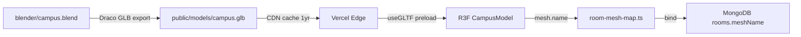
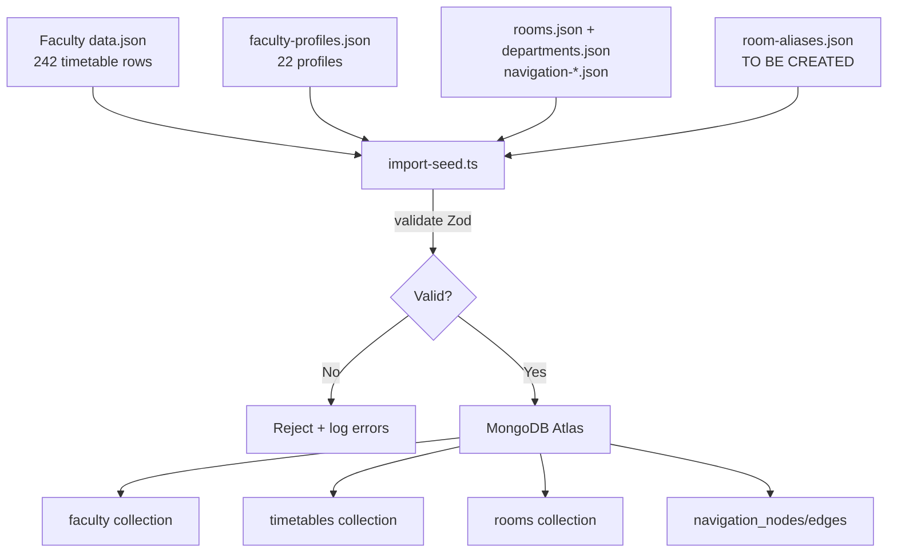
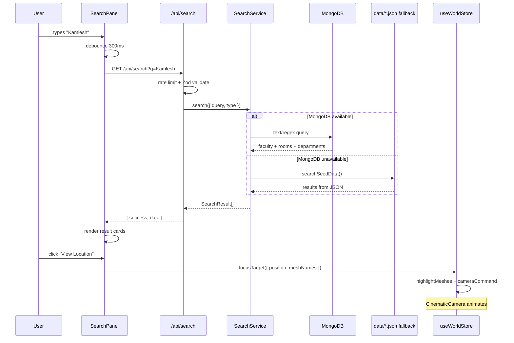
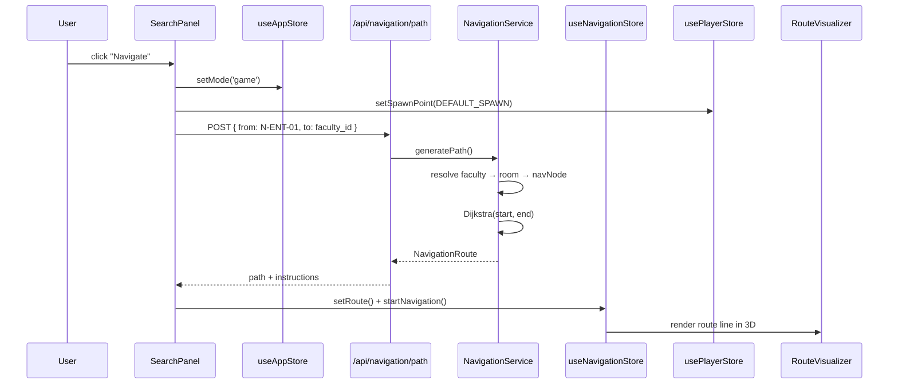
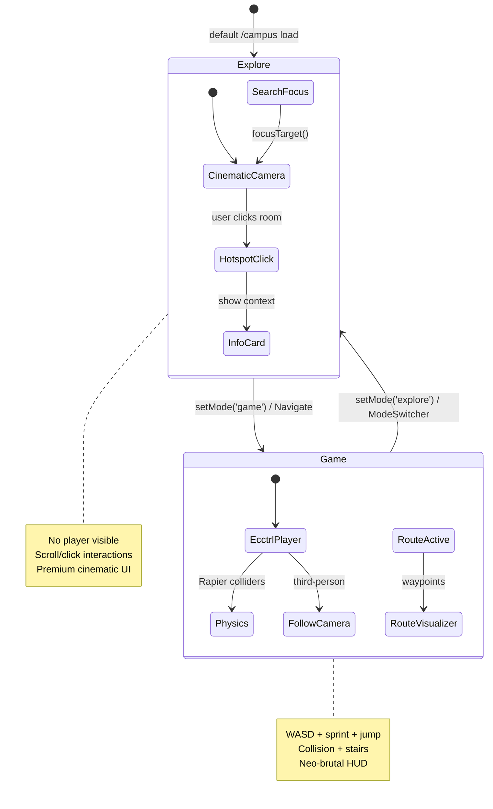
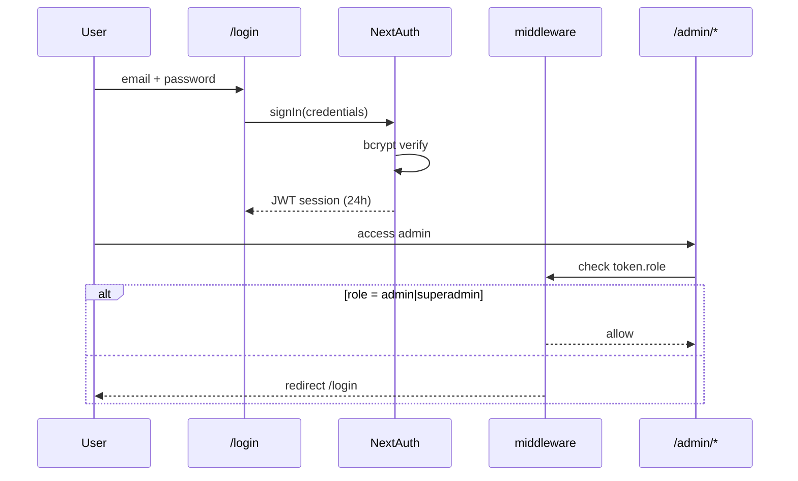
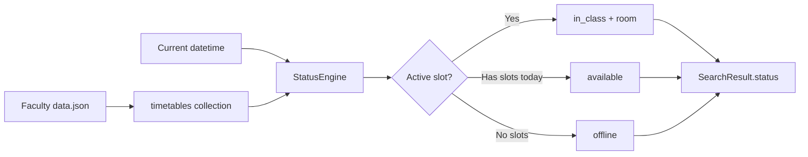

# Data Flow Architecture — Campus Guide 3D

## 1. Asset Pipeline (Blender → Browser)



**Rule:** Campus geometry changes ONLY in Blender. Never edit GLB directly.

---

## 2. Data Import Pipeline



### Faculty Position Resolution

```
faculty-profiles.cabin_number
    → CABIN_TO_MESH map
    → rooms.json position
    → faculty.position { x, y, z }

IF no cabin:
    → most frequent room in Faculty data.json
    → room-aliases.json
    → rooms.json position
```

---

## 3. Search Flow



---

## 4. Navigation Flow



---

## 5. Dual Mode Interaction Flow



**Critical:** Both states share the same `<CampusModel />` instance. No page reload, no scene duplication.

---

## 6. Admin Data Flow

```mermaid
flowchart TD
    A[Admin Panel] -->|Server Action| B[Zod Validation]
    B --> C[requireRole admin]
    C --> D[Service Layer CRUD]
    D --> E[MongoDB Write]
    E --> F[audit_logs insert]
    F --> G[revalidatePath]
    
    H[JSON Upload] --> I[/api/admin/import/json]
    I --> B
    
    J[Coordinate Tool] -->|click in 3D admin view| K[Update room.position]
    K --> D
```

---

## 7. Authentication Flow



---

## 8. Timetable → Live Status Flow



---

## 9. Client State Flow (Zustand)

```
User Action
    ↓
Feature Component (search-panel, mode-switcher)
    ↓
Store Action (useWorldStore.focusTarget)
    ↓
3D Component subscribes (CinematicCamera, CampusModel)
    ↓
Visual update (highlight, camera move, route line)
```

**No prop drilling** across UI ↔ 3D boundary. Stores are the bridge.

---

## 10. Deployment Data Flow

```
git push → Vercel Build
    ├── Static: public/models/campus.glb → CDN (immutable)
    ├── SSR: app/page.tsx → Edge
    ├── API: app/api/* → Serverless Functions
    └── Env: MONGODB_URI, NEXTAUTH_SECRET → Vercel dashboard

MongoDB Atlas ← connection pool ← getDb() singleton
Cloudinary ← signed uploads ← /api/upload
```
