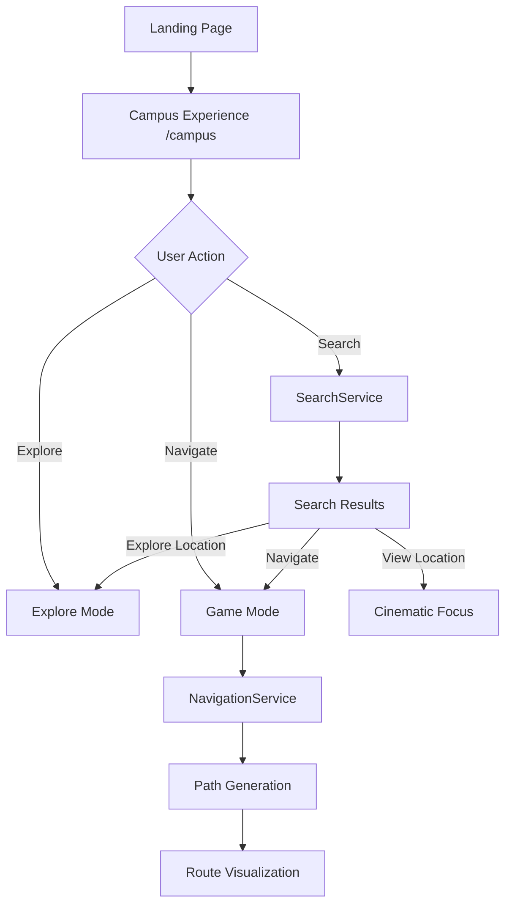

# System Architecture — Campus Guide 3D

## Overview

Campus Guide 3D is a layered, event-driven web platform that renders a single authoritative 3D campus model with two interaction modes (Explore and Game) over shared world state.

```
┌─────────────────────────────────────────────────────────────────┐
│                        Presentation Layer                        │
│  Next.js App Router · shadcn/ui · Neo-Brutalism UI · Motion   │
├─────────────────────────────────────────────────────────────────┤
│                      Application Layer                         │
│  Features (search, explore, game, navigation, admin)           │
│  Zustand Stores · React Hooks · Server Actions                  │
├─────────────────────────────────────────────────────────────────┤
│                       Service Layer                              │
│  SearchService · NavigationService · FacultyService · etc.     │
├─────────────────────────────────────────────────────────────────┤
│                        Data Layer                                │
│  MongoDB Atlas · Mongoose-style schemas · Zod validation       │
├─────────────────────────────────────────────────────────────────┤
│                      3D Engine Layer (Isolated)                  │
│  R3F Scene · Drei · Rapier Physics · ecctrl · Camera Systems   │
└─────────────────────────────────────────────────────────────────┘
```

## Core Principles

### 1. Single World, Dual Mode

One `<CampusWorld />` canvas hosts both Explore and Game modes. Mode switching toggles interaction systems only:

| Subsystem | Explore Mode | Game Mode |
|-----------|-------------|-----------|
| Camera | Cinematic rig | Third-person follow |
| Player | Hidden | ecctrl character |
| Physics | Off (or static colliders) | Rapier dynamic |
| Input | Click / scroll hotspots | WASD + jump + sprint |
| UI | Minimal cinematic overlays | Neo-brutal HUD |

### 2. 3D Engine Isolation

The 3D layer (`src/features/explore`, `src/features/game`, `src/components/3d`) has **zero imports** from services or database code. Communication happens through:

- **Zustand stores** (`useWorldStore`, `useNavigationStore`)
- **Typed events** via store actions
- **Props** from thin orchestrator components

### 3. Blender as Source of Truth

```
blender/campus.blend
    ↓ export (Draco GLB, <5MB target)
web-platform/public/models/campus.glb
```

Room mesh names (`room_001` … `room_045`) map to database records via `meshName` field. Coordinate positions are sampled from mesh centroids at import time.

### 4. Layer Responsibilities

| Layer | Location | Responsibility |
|-------|----------|----------------|
| UI | `components/`, `app/` | Layout, forms, dashboards |
| Features | `features/` | Domain workflows |
| Services | `services/` | Business logic, orchestration |
| Lib | `lib/` | DB, auth, validation, utilities |
| Store | `store/` | Client state |
| Types | `types/` | Shared TypeScript contracts |
| 3D | `features/explore`, `features/game` | Rendering only |

## Application Flow



## Module Boundaries

### Search → 3D Bridge

```typescript
// services/search.service.ts resolves entity
const result = await searchService.find("Dr Sharma");

// store dispatches to 3D layer
useWorldStore.getState().focusTarget({
  position: result.position,
  entityType: "faculty",
  entityId: result.id,
});
```

### Navigation Pipeline

```
Room/Faculty → Nearest NavNode → Dijkstra → 3D Waypoints → Route Mesh
```

## Folder Structure

```
web-platform/src/
├── app/
│   ├── (public)/           # Landing, campus experience
│   ├── (auth)/             # Login, register
│   ├── admin/              # Admin dashboard (RBAC)
│   └── api/                # Route handlers
├── components/
│   ├── ui/                 # shadcn primitives
│   ├── layout/             # Shell, header, footer
│   ├── neo-brutal/         # Neo-brutalism design system
│   └── 3d/                 # Shared 3D primitives
├── features/
│   ├── explore/            # Cinematic mode
│   ├── game/               # Player mode
│   ├── search/             # Search UI + logic
│   ├── navigation/         # Route viz, markers
│   └── admin/              # CRUD panels
├── hooks/
├── lib/
│   ├── auth/
│   ├── db/
│   ├── security/
│   └── validation/
├── services/
├── store/
└── types/
```

## Scalability Considerations

- **Edge caching** for static GLB and textures via Vercel CDN
- **MongoDB indexes** on searchable fields (name, department, roomNumber)
- **Connection pooling** via singleton MongoDB client
- **Dynamic imports** for 3D bundle (`next/dynamic` with `ssr: false`)
- **Rate limiting** on all mutation endpoints
- **Horizontal scaling** — stateless Next.js on Vercel, MongoDB Atlas auto-scale

## Integration Points

| System | Protocol | Purpose |
|--------|----------|---------|
| MongoDB Atlas | MongoDB wire protocol | Primary datastore |
| Cloudinary | REST API | Image/PDF uploads |
| NextAuth | OAuth + Credentials | Authentication |
| Vercel | Git deploy | CI/CD + hosting |
