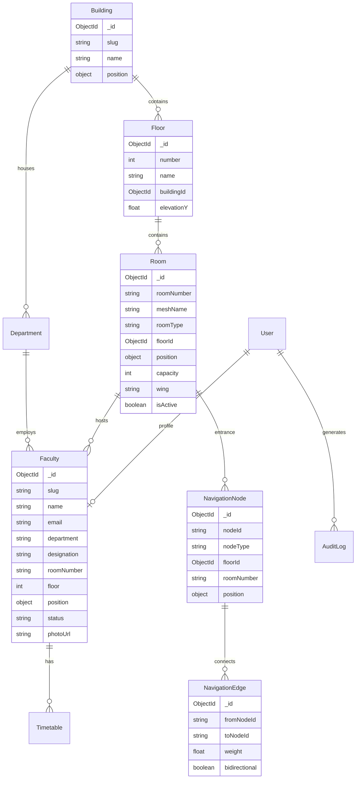

# Database Schema — Campus Guide 3D

**Database:** MongoDB Atlas  
**ODM Pattern:** Native MongoDB driver with Zod-validated document shapes  
**Collection prefix:** None (flat collections)

## Entity Relationship Diagram

## Collections

### `users`

| Field | Type | Index | Notes |
|-------|------|-------|-------|
| `_id` | ObjectId | PK | |
| `email` | string | unique | |
| `name` | string | | |
| `passwordHash` | string | | bcrypt, credentials only |
| `role` | enum | | `visitor`, `student`, `faculty`, `admin`, `superadmin` |
| `departmentId` | ObjectId | sparse | faculty/admin scope |
| `image` | string | | Cloudinary URL |
| `emailVerified` | Date | | |
| `createdAt` | Date | | |
| `updatedAt` | Date | | |

### `buildings`

| Field | Type | Index |
|-------|------|-------|
| `slug` | string | unique |
| `name` | string | |
| `description` | string | |
| `position` | `{ x, y, z }` | |
| `bounds` | `{ min, max }` | campus boundary |

### `floors`

| Field | Type | Index |
|-------|------|-------|
| `number` | int | unique per building |
| `name` | string | |
| `buildingId` | ObjectId | |
| `elevationY` | float | floor height in 3D |

### `rooms`

| Field | Type | Index |
|-------|------|-------|
| `roomNumber` | string | unique |
| `meshName` | string | unique sparse — GLB mesh binding |
| `name` | string | text |
| `roomType` | enum | `classroom`, `lab`, `office`, `library`, etc. |
| `floorId` | ObjectId | |
| `departmentId` | ObjectId | sparse |
| `position` | `{ x, y, z }` | 3D centroid |
| `capacity` | int | |
| `wing` | string | |
| `isActive` | boolean | |

**Indexes:** `{ roomNumber: 1 }`, `{ meshName: 1 }`, `{ name: "text", roomNumber: "text" }`

### `departments`

| Field | Type | Index |
|-------|------|-------|
| `slug` | string | unique |
| `name` | string | text |
| `shortName` | string | |
| `hodFacultyId` | ObjectId | sparse |
| `buildingId` | ObjectId | |
| `floor` | int | |
| `position` | `{ x, y, z }` | HOD office location |
| `color` | string | highlight color hex |

### `faculty`

| Field | Type | Index |
|-------|------|-------|
| `slug` | string | unique |
| `name` | string | text |
| `email` | string | unique sparse |
| `department` | string | text |
| `departmentId` | ObjectId | |
| `designation` | string | |
| `qualification` | string | |
| `specialization` | string | |
| `roomNumber` | string | |
| `floor` | int | |
| `position` | `{ x, y, z }` | 3D marker position |
| `contact` | string | |
| `bio` | string | |
| `photoUrl` | string | Cloudinary |
| `status` | enum | `available`, `in_class`, `in_meeting`, `offline` |
| `userId` | ObjectId | sparse — linked account |
| `subjects` | string[] | |

**Indexes:** `{ name: "text", department: "text", specialization: "text" }`, `{ roomNumber: 1 }`

### `timetables`

| Field | Type | Index |
|-------|------|-------|
| `facultyId` | ObjectId | |
| `dayOfWeek` | int | 0=Mon … 6=Sun |
| `startTime` | string | HH:mm |
| `endTime` | string | HH:mm |
| `roomNumber` | string | |
| `subject` | string | |
| `course` | string | |
| `year` | string | |
| `semester` | string | |
| `branch` | string | |

**Compound index:** `{ facultyId: 1, dayOfWeek: 1, startTime: 1 }`

### `navigation_nodes`

| Field | Type | Index |
|-------|------|-------|
| `nodeId` | string | unique |
| `name` | string | |
| `nodeType` | enum | `room`, `corridor`, `stairs`, `elevator`, `junction`, `entrance` |
| `floorId` | ObjectId | |
| `roomNumber` | string | sparse |
| `position` | `{ x, y, z }` | |

### `navigation_edges`

| Field | Type | Index |
|-------|------|-------|
| `fromNodeId` | string | |
| `toNodeId` | string | |
| `weight` | float | Euclidean or calibrated distance |
| `bidirectional` | boolean | default true |

**Compound index:** `{ fromNodeId: 1, toNodeId: 1 }` unique

### `notices`

| Field | Type | Notes |
|-------|------|-------|
| `title` | string | |
| `content` | string | sanitized HTML |
| `type` | enum | `notice`, `circular`, `event` |
| `priority` | enum | `low`, `normal`, `high`, `urgent` |
| `attachments` | `{ url, name, mimeType }[]` | Cloudinary |
| `publishedAt` | Date | |
| `expiresAt` | Date | nullable |
| `createdBy` | ObjectId | |
| `isPublished` | boolean | |

### `documents`

Unstructured admin uploads (PDFs, circulars).

| Field | Type |
|-------|------|
| `title` | string |
| `fileUrl` | string |
| `mimeType` | string |
| `category` | string |
| `tags` | string[] |
| `uploadedBy` | ObjectId |

### `audit_logs`

| Field | Type |
|-------|------|
| `userId` | ObjectId |
| `action` | string |
| `resource` | string |
| `resourceId` | string |
| `metadata` | object |
| `ip` | string |
| `userAgent` | string |
| `timestamp` | Date |

**TTL:** Optional 90-day retention via `{ timestamp: 1 }` TTL index

### `analytics_events`

| Field | Type |
|-------|------|
| `event` | string |
| `sessionId` | string |
| `userId` | ObjectId sparse |
| `payload` | object |
| `timestamp` | Date |

## Data Import Strategy

1. Seed from `data/*.json` via `database/scripts/import-seed.ts`
2. Mesh-to-room binding validated against GLB node names
3. Faculty positions derived from room centroids + offset
4. Navigation graph seeded separately (admin tool or Blender markers)

## Migration Policy

- Schema changes are **additive** (no destructive migrations in production)
- Zod schemas versioned in `lib/validation/schemas/`
- Backfill scripts in `database/scripts/`
